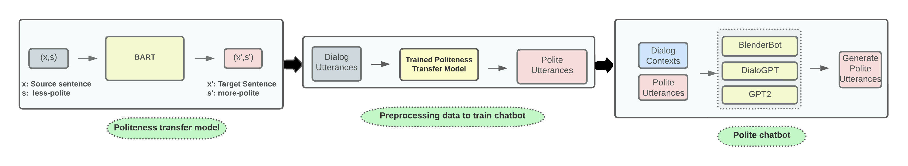

# Polite Chatbot: A Text Style Transfer Application

This repo contains the code and data of the paper: [Polite Chatbot: A Text Style Transfer Application]().

## Overview

Our method: We (1) train the politeness transfer model; (2) generate synthetic training data by applying the transfer model to neutral utterances; (3) train the dialogue models using the synthetic data.

  

## License

    Author: Sourabrata Mukherjee
    Copyright © 2023 Sourabrata Mukherjee.
    Licensed under the MIT License.

## Acknowledgements

This research was supported by Charles University projects GAUK 392221, GAUK 302120, and SVV 260575, and by the European Research Council (Grant agreement No. 101039303 NG-NLG).
